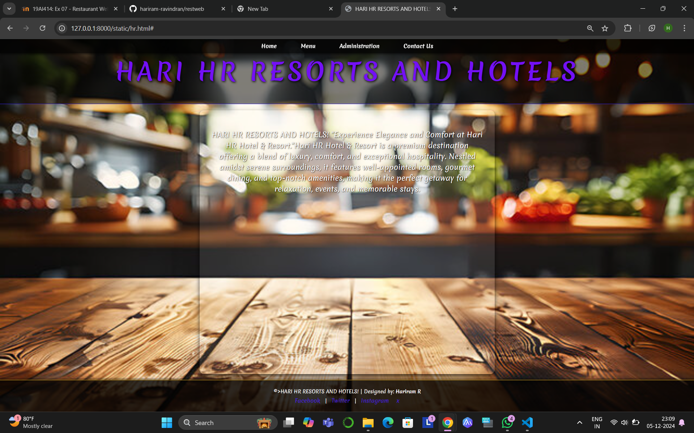
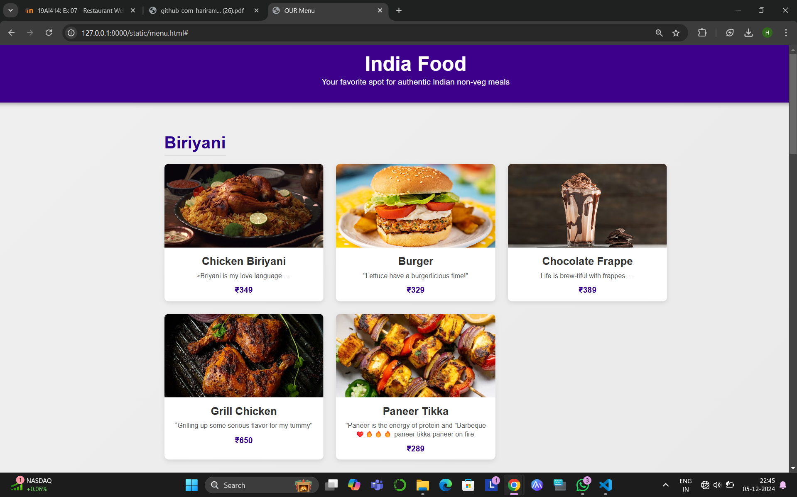
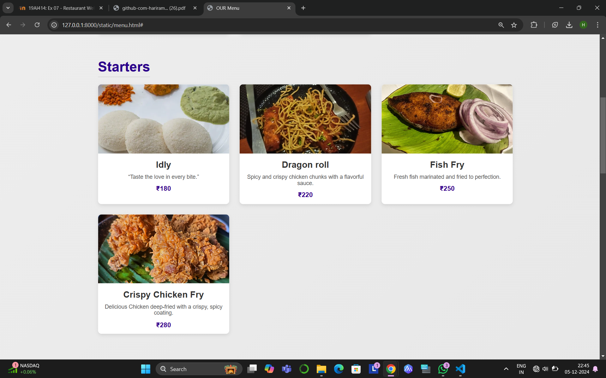
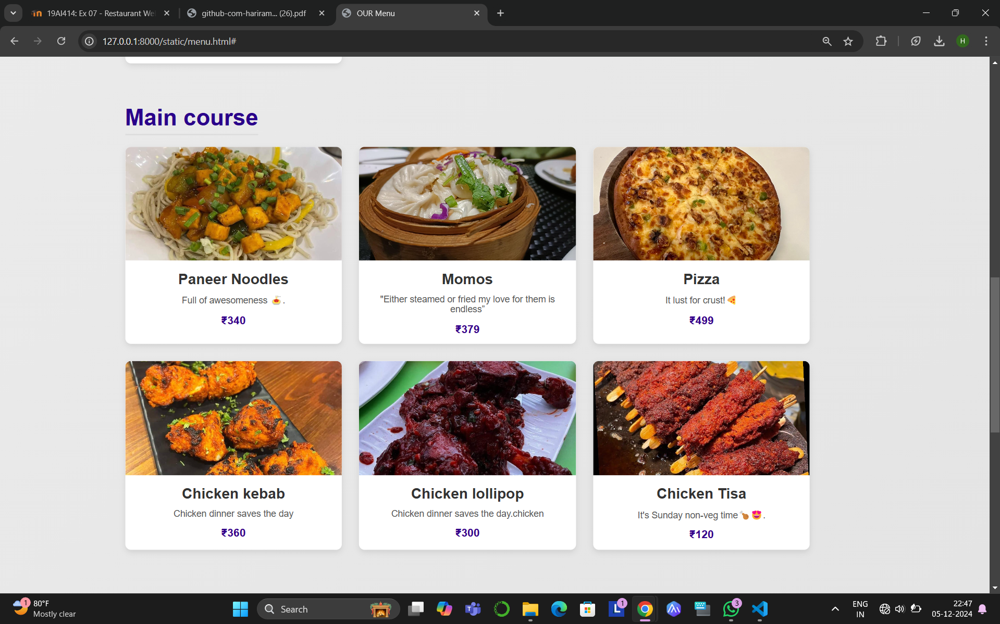
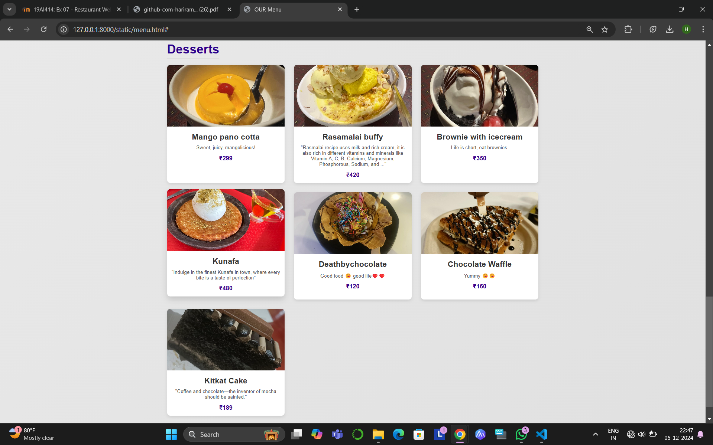
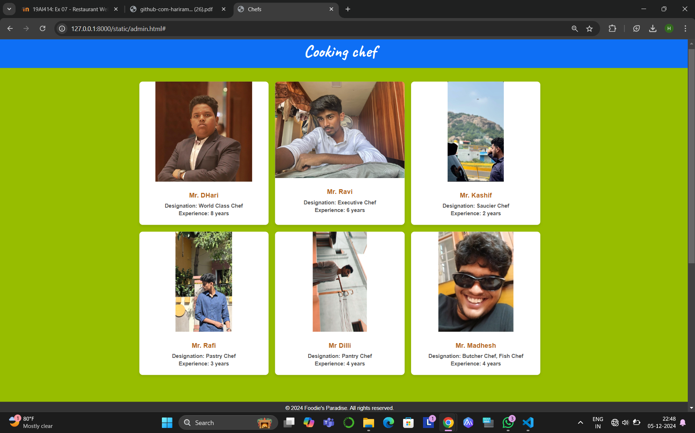
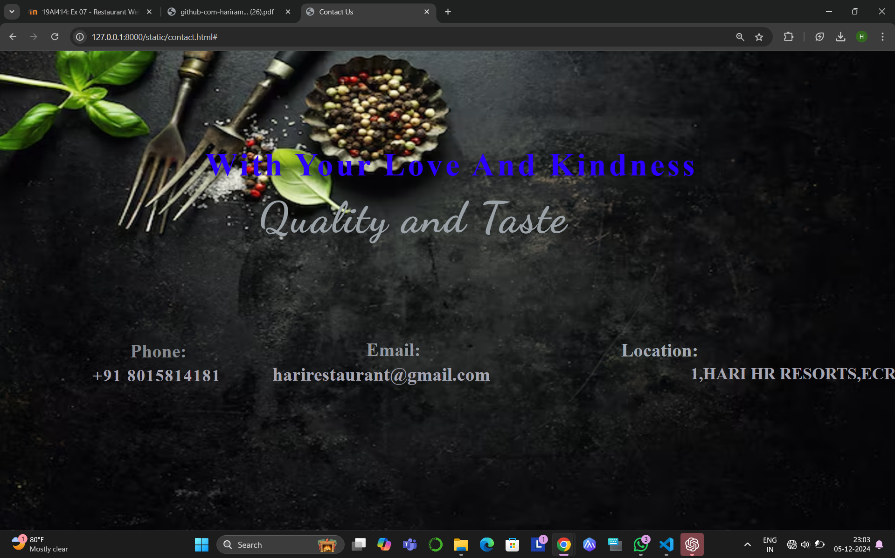

# Ex.07 Restaurant Website
## Date:5.12.2024

## AIM:
To develop a static Restaurant website to display the food items and services provided by them.

## DESIGN STEPS:

### Step 1:
Requirement collection.

### Step 2:
Creating the layout using HTML and CSS.

### Step 3:
Updating the sample content.

### Step 4:
Choose the appropriate style and color scheme.

### Step 5:
Validate the layout in various browsers.

### Step 6:
Validate the HTML code.

### Step 7:
Publish the website in the given URL.

## PROGRAM:
```
Admin html

<html lang="en">
<head>
    <meta charset="UTF-8">
    <meta name="viewport" content="width=device-width, initial-scale=1.0">
    <title>Chefs</title>
    <link rel="preconnect" href="https://fonts.googleapis.com">
    <link rel="preconnect" href="https://fonts.gstatic.com" crossorigin>
    <link href="https://fonts.googleapis.com/css2?family=Caveat:wght@700&family=Pacifico&display=swap" rel="stylesheet">
    <style>
        body {
            margin: 0;
            padding: 0;
            font-family: Arial, sans-serif;
            background-color: #97bd00;
        }


        /* Header Section */
        header {
            text-align: center;
            background-color: #0e6ff5;
            padding: 20px 0;
        }

        header h1 {
            font-family: "Caveat", cursive;
            font-size: 50px;
            color: rgb(216, 16, 16);
            margin: 0;
        }

        /* Chef Profiles Section */
        .chefs-container {
            display: grid;
            grid-template-columns: repeat(auto-fit, minmax(300px, 1fr));
            gap: 20px;
            padding: 40px;
            max-width: 1200px;
            margin: auto;
        }

        .chef-card {
            background-color: rgb(164, 17, 17);
            border-radius: 10px;
            box-shadow: 0 4px 8px rgba(0, 0, 0, 0.1);
            overflow: hidden;
            text-align: center;
            transition: transform 0.3s ease, box-shadow 0.3s ease;
        }

        .chef-card:hover {
            transform: translateY(-5px);
            box-shadow: 0 8px 16px rgba(0, 0, 0, 0.2);
        }

        .chef-card img {
            width: 100%;
            object-fit: contain; /* Ensure the entire image fits without cropping */
            max-height: 300px; /* Allow flexibility but limit height */
        }

        .chef-details {
            padding: 20px;
        }

        .chef-details h1 {
            font-size: 20px;
            color: #b5651d;
            margin: 10px 0;
        }

        .chef-details h2,
        .chef-details h3 {
            font-size: 16px;
            color: #555;
            margin: 5px 0;
        }

        /* Footer Section */
        footer {
            text-align: center;
            background-color: #333;
            color: rgb(146, 25, 25);
            padding: 10px 0;
            margin-top: 40px;
        }

        footer p {
            margin: 0;
        }
    </style>
</head>
<body>

    <!-- Header Section -->
    <header>
        <h1>Cooking chef</h1>
    </header>

    <!-- Chefs Profiles Section -->
    <div class="chefs-container">
        <div class="chef-card">
            
            <div class="chef-details">
                <h1>Mr. DHari</h1>
                <h2>Designation: World Class Chef</h2>
                <h3>Experience: 8 years</h3>
            </div>
        </div>
        <div class="chef-card">
            
            <div class="chef-details">
                <h1>Mr. Ravi</h1>
                <h2>Designation: Executive Chef</h2>
                <h3>Experience: 6 years</h3>
            </div>
        </div>
        <div class="chef-card">
            
            <div class="chef-details">
                <h1>Mr. Kashif</h1>
                <h2>Designation: Saucier Chef</h2>
                <h3>Experience: 2 years</h3>
            </div>
        </div>
        <div class="chef-card">
            
            <div class="chef-details">
                <h1>Mr. Rafi</h1>
                <h2>Designation: Pastry Chef</h2>
                <h3>Experience: 3 years</h3>
            </div>
        </div>
        <div class="chef-card">
            
            <div class="chef-details">
                <h1>Mr Dilli</h1>
                <h2>Designation: Pantry Chef</h2>
                <h3>Experience: 4 years</h3>
            </div>
        </div>
        <div class="chef-card">
            
            <div class="chef-details">
                <h1>Mr. Madhesh</h1>
                <h2>Designation: Butcher Chef, Fish Chef</h2>
                <h3>Experience: 4 years</h3>
            </div>
        </div>
    </div>

    <!-- Footer Section -->
    <footer>
        <p>&copy; 2024 Foodie's Paradise. All rights reserved.</p>
    </footer>

</body>
</html>

menu html

<!DOCTYPE html>
<html lang="en">
<head>
    <meta charset="UTF-8">
    <meta name="viewport" content="width=device-width, initial-scale=1.0">
    <link rel="preconnect" href="https://fonts.googleapis.com">
    <link rel="preconnect" href="https://fonts.gstatic.com" crossorigin>
    <link href="https://fonts.googleapis.com/css2?family=Courgette&family=Merienda:wght@300..900&display=swap" rel="stylesheet">
    <title>HARI HR RESORTS AND HOTELS</title>
    <style>
        body {
            margin: 0;
            font-family: 'Merienda', cursive;
            background-image: url("bg.jpg");
            background-size: cover;
            color: rgb(115, 16, 245);
            display: flex;
            flex-direction: column;
            min-height: 100vh;
        }

        header {
            text-align: center;
            padding: 50px 20px;
            background: rgba(0, 0, 0, 0.5); /* Semi-transparent overlay */
            border-bottom: 2px solid rgb(51, 32, 218);
        }

        header h1 {
            font-size: 80px;
            letter-spacing: 10px;
            margin: 0;
            text-shadow: 2px 2px 8px black;
            animation: fadeIn 2s ease-in-out;
        }

        nav {
            position: fixed;
            top: 0;
            left: 0;
            width: 100%;
            background: rgba(0, 0, 0, 0.7); /* Transparent navbar */
            box-shadow: 0 4px 6px rgba(0, 0, 0, 0.5);
            z-index: 1000;
        }

        nav ul {
            list-style: none;
            margin: 0;
            padding: 10px 20px;
            display: flex;
            justify-content: center;
            animation: slideDown 1.5s ease-out;
        }

        nav li {
            margin: 0 20px;
        }

        nav a {
            text-decoration: none;
            color: white;
            font-size: 18px;
            font-weight: 600;
            padding: 10px 20px;
            transition: all 0.3s ease-in-out;
            border-radius: 5px;
        }

        nav a:hover {
            color: black;
            background: linear-gradient(to right, rgb(46, 25, 203), gold);
            transform: scale(1.1);
        }

        main {
            flex: 1;
            padding: 40px;
            text-align: center;
            background: rgba(255, 255, 255, 0.1); /* Semi-transparent content box */
            margin: 20px auto;
            max-width: 900px;
            border-radius: 15px;
            box-shadow: 0 8px 16px rgba(0, 0, 0, 0.7);
            animation: fadeInUp 1.5s ease-in-out;
        }

        main p {
            font-size: 24px;
            font-weight: 400;
            line-height: 1.5;
            color: #f9f9f9;
            text-shadow: 1px 1px 3px black;
        }

        footer {
            background: rgba(0, 0, 0, 0.8); /* Transparent footer */
            color: white;
            text-align: center;
            padding: 20px 0;
            border-top: 2px solid goldenrod;
            box-shadow: 0 -4px 6px rgba(0, 0, 0, 0.5);
        }

        footer p {
            margin: 5px 0;
            font-size: 16px;
        }

        footer a {
            color: rgb(72, 32, 218);
            text-decoration: none;
            margin: 0 10px;
            font-size: 18px;
            transition: color 0.3s ease-in-out;
        }

        footer a:hover {
            color: #3c37d4;
        }

        @media (max-width: 768px) {
            header h1 {
                font-size: 50px;
                letter-spacing: 5px;
            }

            nav a {
                font-size: 16px;
                padding: 8px 12px;
            }

            main p {
                font-size: 20px;
            }

            footer p, footer a {
                font-size: 16px;
            }
        }

        /* Animations */
        @keyframes fadeIn {
            from {
                opacity: 0;
            }
            to {
                opacity: 1;
            }
        }

        @keyframes slideDown {
            from {
                transform: translateY(-100%);
                opacity: 0;
            }
            to {
                transform: translateY(0);
                opacity: 1;
            }
        }

        @keyframes fadeInUp {
            from {
                transform: translateY(20px);
                opacity: 0;
            }
            to {
                transform: translateY(0);
                opacity: 1;
            }
        }
    </style>
</head>
<body>
    <header>
        <h1>HARI HR RESORTS AND HOTELS</h1>
    </header>
    <nav>
        <ul>
            <li><a href="#" title="Home">Home</a></li>
            <li><a href="Menu enchanced.html" title="Menu">Menu</a></li>
            <li><a href="Administration enhanced.html" title="Administration">Administration</a></li>
            <li><a href="contact gpt.html" title="Contact Us">Contact Us</a></li>
        </ul>
    </nav>
    <main>
        <p>HARI HR RESORTS AND HOTELS! "Experience Elegance and Comfort at Hari HR Hotel & Resort."Hari HR Hotel & Resort is a premium destination offering a blend of luxury, comfort, and exceptional hospitality. Nestled amidst serene surroundings, it features well-appointed rooms, gourmet dining, and top-notch amenities, making it the perfect getaway for relaxation, events, and memorable stays.</p>
    </main>
    <footer>
        <p>&copy;>HARI HR RESORTS AND HOTELS! | Designed by: <b>Hariram R</b></p>
        <p>
            <a href="#" title="Facebook">Facebook</a> |
            <a href="#" title="Twitter">Twitter</a> |
            <a href="#" title="Instagram">Instagram</a>
            <a href="#" title="Instagram">x</a>
        </p>
    </footer>
</body>
</html>

contact html

<html>
    <head>
        <link rel="preconnect" href="https://fonts.googleapis.com">
        <link rel="preconnect" href="https://fonts.gstatic.com" crossorigin>
        <link href="https://fonts.googleapis.com/css2?family=Dancing+Script:wght@400..700&display=swap" rel="stylesheet">
        <title>Contact Us</title>
        <style>
            #n1{
                position: relative;
                color: rgb(43, 0, 255);
                font-size: 60px;
                padding-left: 380px;
                left: 0px;
                top: 190px;
                letter-spacing: 5px;
            }
            body{
                background-image: url("bacgrounf.jpg");
                background-repeat: no-repeat;
                background-size: 1700px 950px;
            }
            #n2{
                position:relative;
                color: rgb(155, 163, 169);
                font-size: 80px;
                padding-left: 480px;
                top: 140px;
                letter-spacing: 3px;
                font-family: "Dancing Script", cursive;
            }
            #n3{
                position: relative;
                color: rgb(131, 137, 143);
                font-size: 35px;
                top: 255px;
                padding-left: 240px;
            }
            #n4{
                position: relative;
                color: rgb(125, 125, 129);
                font-size:31px;
                top: 205px;
                padding-left: 170px;
                letter-spacing: 2px;
            }
            #n5{
                position: relative;
                color: rgb(147, 153, 159);
                font-size: 35px;
                top: 60px;
                padding-left: 680px;
            }
            #n6{
                position: relative;
                color: rgb(138, 137, 148);
                font-size:35px;
                top: 8px;
                padding-left: 505px;
            }
            #n7{
                position: relative;
                color: rgb(162, 171, 179);
                font-size: 35px;
                bottom: 135px;
                padding-left: 1155px;
            }
            #n8{
                position: relative;
                color: rgb(145, 142, 151);
                font-size: 31px;
                bottom: 187px;
                padding-left: 950px;
                text-align: center;
            }

            /* Add styles for the anchor tags */
            a {
                color: rgb(166, 165, 178);
                text-decoration: none;
                cursor: pointer;
            }

            /* Add a hover effect to indicate clickable links */
            a:hover {
                text-decoration: underline;
            }
            
        </style>
    </head>
    <body>
        <h1 id="n1">With Your Love And Kindness</h1>
        <h2 id="n2">Quality and Taste</h2>
        <h5 id="n3">Phone:</h5>
        <h5 id="n4">
            <a href="tel:+918015814181">+91 8015814181</a>
        </h5>
        <h5 id="n5">Email:</h5>
        <h5 id="n6">
            <a href="HARI HR RESORTS AND HOTELS"><b>harirestaurant@gmail.com</b></a>
        </h5>
        <h5 id="n7">Location:</h5>
        <h5 id="n8">
            <a href="https://www.google.com/maps?q=1,+HARI+HR+RESORTS+AND+HOTELS+OMR+street+Ecr"><b>1,HARI HR RESORTS,ECR</b> 
        <b></b>Ecr ram street zunga</b></a>
        </h5>
    </body>
</html>

```

## OUTPUT:
 
 
 
 
 
 


## RESULT:
The program for designing software company website using HTML and CSS is completed successfully.
